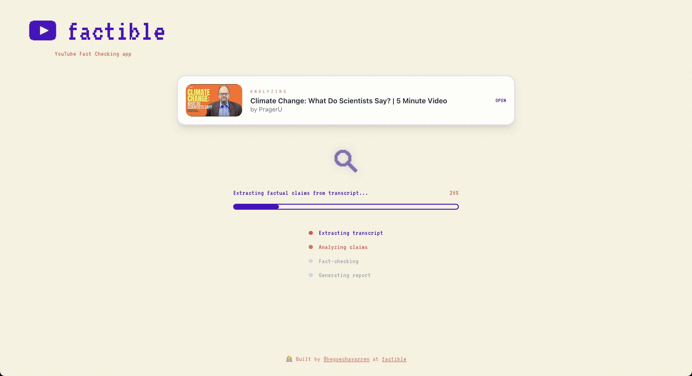
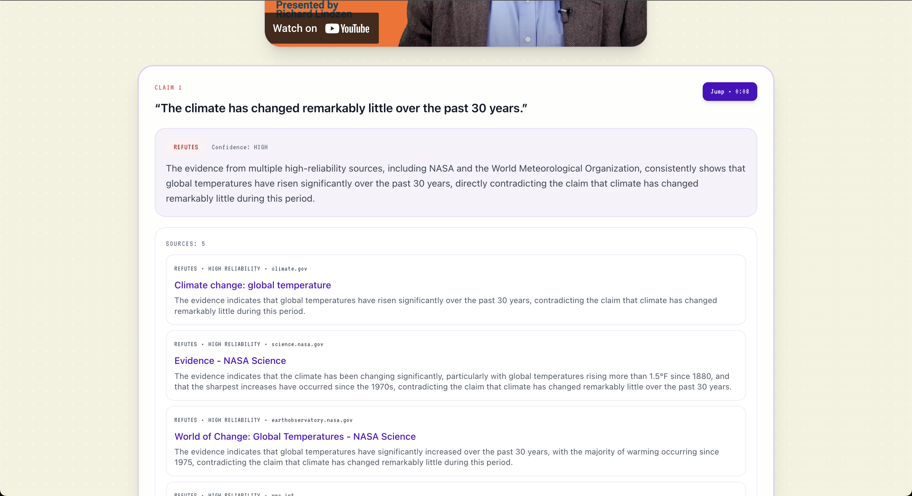

<div align="center">
  <h1>🕵️‍♂️ factible</h1>
  <p>E2E project to fact check YouTube videos</p>
</div>
<p align="center">
  <br/>
  <em>Landing page</em>
</p>

<p align="center">
  <br/>
  <em>Real-time updates</em>
</p>

<p align="center">
  <br/>
  <em>Results page</em>
</p>

<p align="center">
  <br/>
  <em>Results per claim</em>
</p>

## Getting Started

### Environment

```bash
# backend/.env
OPENAI_API_KEY=your_key
SERPER_API_KEY=your_key

# Optional (proxy for web scraping)
WEBSHARE_PROXY_USERNAME=your_username
WEBSHARE_PROXY_PASSWORD=your_password
WEBSHARE_PROXY_LOCATION=es
```

### Web App

```bash
# Backend
cd backend && uv run python -m factible_api.main
```

```bash
# Frontend (http://localhost:5173)
cd frontend && npm install && npm run dev
```

### Experiments CLI

```bash
cd backend

# Run experiments
uv run factible-experiments run --experiment baseline
uv run factible-experiments run --experiment precision_recall_curve

# Evaluate (for multi-config experiments, evaluate each subdir)
uv run factible-experiments evaluate \
    --runs-dir experiments/data/runs/<run_dir>

# Generate precision-recall curve (run after evaluating each max_claims subdir)
uv run factible-experiments precision-recall \
    --eval-dir experiments/data/eval_results/<eval_dir>
```
